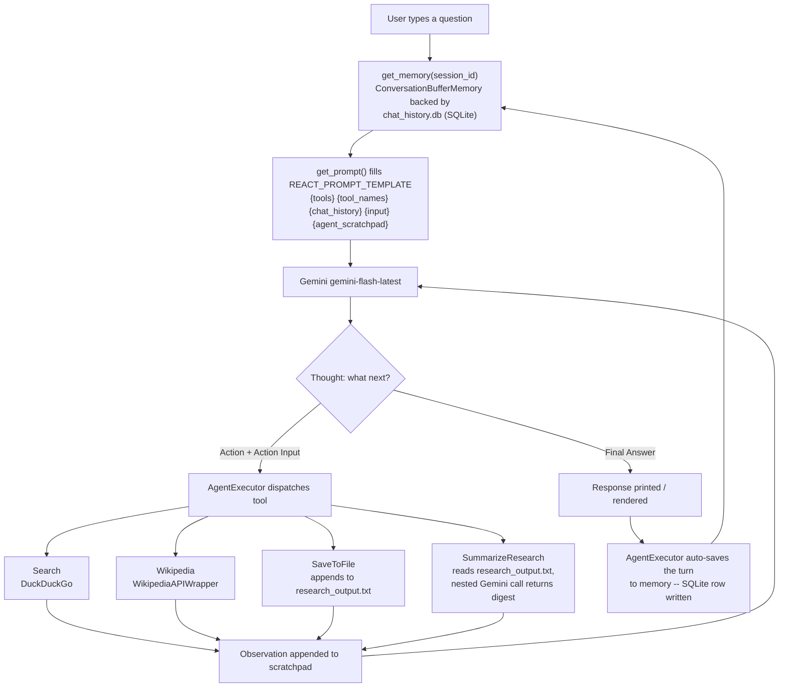
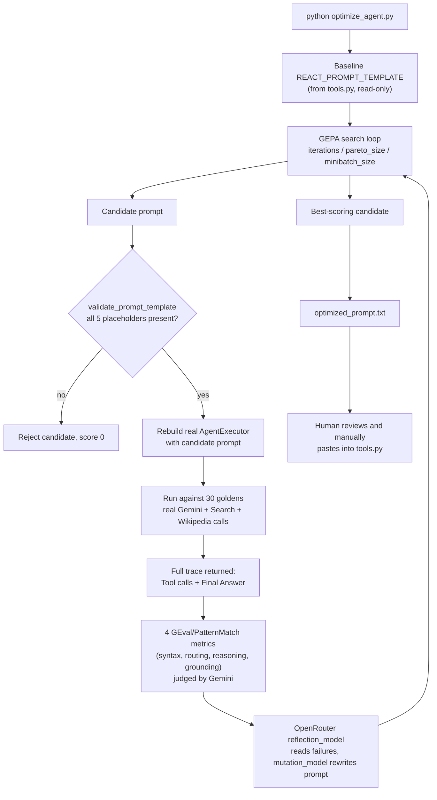

# Gemini ReAct Research Agent

An autonomous AI agent capable of conducting web research, scraping Wikipedia, and saving structured summaries to local storage. Built with **Python**, **LangChain**, and **Google's Gemini**, with SQLite-backed conversation memory that survives restarts.

## Architecture

The agent follows the **ReAct (Reason + Act)** paradigm:

1. **Thinks** – Analyzes the user's request and decides what action to take
2. **Acts** – Selects and executes the appropriate tool
3. **Observes** – Processes the tool's output
4. **Refines** – Iteratively improves the answer based on observations

This loop continues until the agent reaches a conclusion, which is then automatically saved to disk.

## Data Flow

### Runtime (`main.py` / `app.py`)



Every turn re-fills the same 5 placeholders from `tools.py`, loops Thought → Action → Observation until `Final Answer:`. `AgentExecutor(memory=...)` auto-loads `{chat_history}` before the run and auto-persists the exchange to `chat_history.db` after — no manual buffer building, and the conversation survives quitting the process or reloading the Streamlit app.

### Offline (`optimize_agent.py`) — manual only, never runs automatically



GEPA never writes to `tools.py` directly — a human has to read `optimized_prompt.txt` and paste it in for the change to reach the live agent.

## Key Features

- **LLM**: Google's `gemini-flash-latest` for high-speed reasoning
- **Web Research**: Real-time search via DuckDuckGo
- **Knowledge Base**: Factual lookups via Wikipedia API
- **File Persistence**: Automatically saves research findings with timestamps
- **Research Summarizer**: A `SummarizeResearch` tool that digests all past `research_output.txt` entries via a nested Gemini call — ask "summarize my past research" (optionally with a focus topic) and only the condensed digest enters the agent's context, no matter how large the log grows
- **Persistent Chat Memory**: `tools.py`'s `get_memory()` backs each session with a `ConversationBufferMemory` stored in `chat_history.db` (SQLite), so conversations survive process restarts and Streamlit reloads — not just an in-memory session
- **Shared Tool/Prompt/Memory Definitions**: `main.py` and `app.py` both import tools, the ReAct prompt template, and the memory builder from `tools.py` instead of duplicating them

## Requirements

- Python 3.10+
- Google Gemini API key
- Internet connection for web search and Wikipedia
- `deepeval` + OpenRouter API key (optional, only for `optimize_agent.py`)

## Setup

### 1. Clone the repository
```bash
git clone https://github.com/yourusername/ai-react-agent.git
cd ai-react-agent
```

### 2. Create virtual environment
```bash
python -m venv .venv
.venv\Scripts\activate  # Windows
# or
source .venv/bin/activate  # macOS/Linux
```

### 3. Install dependencies
```bash
pip install -r requirements.txt
```

### 4. Set up environment variables
Create a `.env` file in the project root:
```bash
cp .env.example .env
```

Edit `.env` and add your Google Gemini API key:
```
Gemini_API_KEY=your_actual_api_key_here
```

Get your API key from [Google AI Studio](https://aistudio.google.com/apikey).

Only needed if you plan to run `optimize_agent.py`, add a free [OpenRouter](https://openrouter.ai/keys) key too:
```
OPENROUTER_API_KEY=your_openrouter_api_key_here
```

## Demo

Watch a quick demo of the agent in action:
- **File**: `demos/agent_demo.mkv` (712 KB)
- **Shows**: Interactive Streamlit UI, web research, Wikipedia lookups, auto-save functionality

## Usage

### Option 1: Web UI (Recommended)
Run the Streamlit frontend:
```bash
streamlit run app.py
```

This opens an interactive chat interface in your browser at `http://localhost:8501`:
- Chat with the agent
- View thinking process
- Auto-saves research findings
- Toggle tools and settings

### Option 2: CLI Mode
Run the agent in interactive terminal mode:
```bash
python main.py
```

Then ask questions:
```
User: What are the latest developments in electric vehicles?
Agent: [Researches, thinks, saves results to research_output.txt]
Final Answer: ...
```

### How It Works

The agent automatically:
- Searches the web for current information
- Looks up facts from Wikipedia
- **Saves all research to `research_output.txt`** with timestamps
- Summarizes past research on request — ask *"summarize my past research"* (or *"summarize what I've researched about AI"* for a focused digest) and the `SummarizeResearch` tool condenses the whole log via a nested Gemini call
- Remembers previous questions across the whole conversation, persisted to `chat_history.db` (SQLite) — quit and restart `main.py`, or reload the Streamlit page, and the conversation is still there. CLI and web UI keep separate histories (`session_id="cli"` vs. `"streamlit"`).

## Project Structure

```
.
├── app.py                  # Streamlit web UI
├── main.py                 # CLI agent loop and orchestration
├── tools.py                # Tool definitions, shared ReAct prompt template, and get_memory()
├── optimize_agent.py       # Offline GEPA prompt optimization (run: python optimize_agent.py)
├── test_tools.py           # Smoke check for tools.py (run: python test_tools.py)
├── test_optimize_agent.py  # Smoke check for optimize_agent.py's placeholder guard
├── .env.example            # Environment variable template
├── requirements.txt        # Python dependencies
├── research_output.txt     # Auto-generated research findings
├── chat_history.db         # Auto-generated SQLite conversation memory (gitignored)
├── demos/
│   └── agent_demo.mkv      # Demo video (712 KB)
└── README.md               # This file
```

## Testing

There's no full test suite, but two smoke checks guard the shared building blocks:

```bash
python test_tools.py           # tools.py exposes the expected tools + prompt variables
python test_optimize_agent.py  # optimize_agent.py's placeholder guard catches broken prompt candidates
```

## Prompt Optimization (optional)

`optimize_agent.py` runs deepeval's GEPA algorithm against a 30-question golden dataset (10 categories of known ReAct failure modes — recency bias, missing file persistence, multi-step comparisons, syntax breakage, tool misallocation, error fallbacks, premature termination, argument passing, conversational distraction, and infinite-loop prevention) to search for an improved `REACT_PROMPT_TEMPLATE`. It's an offline, human-in-the-loop script — it never modifies `tools.py` directly.

```bash
pip install deepeval
python optimize_agent.py
```

- Runs the real `AgentExecutor` from `tools.py` (`get_tools()` / `REACT_PROMPT_TEMPLATE`) against each golden. `model_callback` returns the full tool-call trace (not just the final answer), since scoring depends on which tools were called and how many reasoning cycles ran.
- **Grading uses 4 decoupled metrics** instead of one blended score, so GEPA's reflection step gets a clear signal per failure mode:
  - `react_syntax_metric` — pattern-matches for well-formed `Action:`/`Action Input:` pairs in the trace
  - `tool_routing_metric` — did the agent pick the right tool (Wikipedia vs. Search vs. SaveToFile)?
  - `reasoning_depth_metric` — did multi-part queries get multiple distinct tool calls, and did the agent avoid looping?
  - `factual_grounding_metric` — does the agent search for current/recent info instead of hallucinating or refusing on the grounds the year is "in the future"?
- **Grading** (all `GEval` metrics) uses Gemini via deepeval's `GeminiModel`. **Reflection and mutation** (GEPA proposing and rewriting candidate prompts) use `OpenRouterModel` on a free-tier model (`meta-llama/llama-3.3-70b-instruct:free` by default, override via `OPENROUTER_MODEL_NAME`) — no OpenAI key required anywhere in the pipeline.
- Any candidate prompt missing a required placeholder (`{tools}`, `{tool_names}`, `{chat_history}`, `{input}`, `{agent_scratchpad}`) is rejected before it can break `create_react_agent()`.
- On success, writes the best candidate to `optimized_prompt.txt` for manual review before copying it into `tools.py`.
- A full run (30 goldens × up to 7 GEPA iterations, each doing real Gemini/DuckDuckGo/Wikipedia calls) takes a while and makes many API calls — consider lowering `iterations`/`minibatch_size` in `optimize_agent.py` for a quick sanity check first.

## Customization

### Adding New Tools

Edit `tools.py` and create a new function:
```python
def my_custom_tool(input: str):
    """Your tool description."""
    # Your logic here
    return result

# Register in get_tools():
Tool(
    name="MyTool",
    func=my_custom_tool,
    description="What this tool does"
)
```

### Modifying the Prompt

Edit `REACT_PROMPT_TEMPLATE` in `tools.py` to change agent behavior, reasoning steps, or output format. Both `main.py` and `app.py` pull the prompt from `get_prompt()`, so a change there applies to both entry points.

### Memory / Conversation History

Both entry points call `get_memory(session_id=...)` in `tools.py`, which returns a `ConversationBufferMemory` backed by a `SQLChatMessageHistory` pointed at `chat_history.db`. `main.py` uses `session_id="cli"`, `app.py` uses `session_id="streamlit"`, so the two don't mix. To reset a conversation, delete `chat_history.db` (or call `memory.clear()`, which the Streamlit sidebar's "Clear Chat History" button already does) — or use a different `session_id` to start a fresh thread without touching existing history.

## Troubleshooting

**Error: `No module named 'dotenv'`**
```bash
pip install python-dotenv
```

**Error: `Could not import ddgs`**
```bash
pip install ddgs
```

**Agent not saving results?**
- Verify `SaveToFile` tool is being invoked in the agent's thought process
- Check file permissions in your project directory
- Review `research_output.txt` to confirm writes

**Rate limit errors (429)?**
- The agent uses `gemini-flash-latest` which has built-in rate limiting
- Add delays between queries or reduce request frequency


## License

MIT License - Feel free to use this project for research and personal use.


